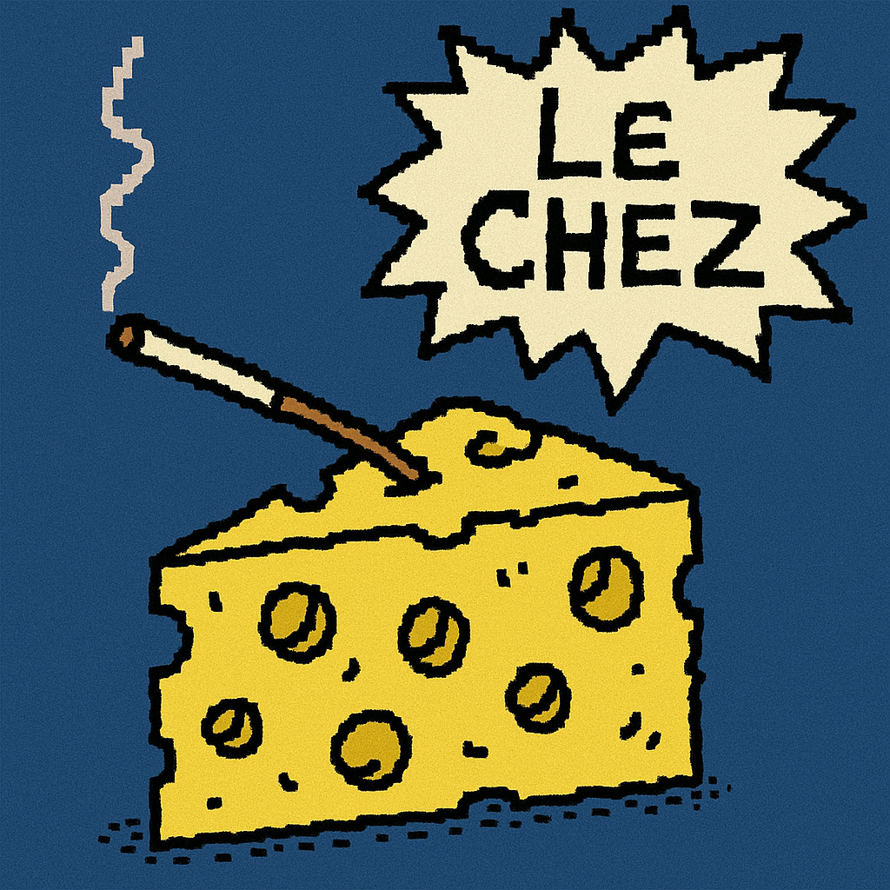

# Chez: Type-Safe JSON Schema Ecosystem for Scala 3

<div align="center">
  
  
  *Le Chez says: "Your schemas are probably wrong"*
</div>

[](https://github.com/silvabyte/scalaschemaz)
[](https://opensource.org/licenses/MIT)

An ecosystem of libraries for JSON Schema generation, HTTP validation & Automatic OpenAPI Spec Generation, and LLM integration in Scala 3. Each module can be used independently or together for a complete solution.

## Installation

Choose the modules you need for your project:

### Mill

```scala
// Just schema validation
mvn"com.silvabyte::chez:0.2.0"

// Add HTTP validation for Cask web framework
mvn"com.silvabyte::chez:0.2.0"
mvn"com.silvabyte::caskchez:0.2.0"

// Full ecosystem with LLM agent support
mvn"com.silvabyte::chez:0.2.0"
mvn"com.silvabyte::caskchez:0.2.0"
mvn"com.silvabyte::chezwiz:0.2.0"
```

### SBT

```scala
// Just schema validation
libraryDependencies += "com.silvabyte" %% "chez" % "0.2.0"

// Add HTTP validation for Cask web framework
libraryDependencies ++= Seq(
  "com.silvabyte" %% "chez" % "0.2.0",
  "com.silvabyte" %% "caskchez" % "0.2.0"
)

// Full ecosystem with LLM agent support
libraryDependencies ++= Seq(
  "com.silvabyte" %% "chez" % "0.2.0",
  "com.silvabyte" %% "caskchez" % "0.2.0",
  "com.silvabyte" %% "chezwiz" % "0.2.0"
)
```

## The Ecosystem

- **[Chez](./docs/chez.md)**: Core JSON Schema library with TypeBox-like ergonomics
- **[CaskChez](./docs/caskchez.md)**: Automatic HTTP validation for Cask web framework
- **[ChezWiz](./docs/chezwiz.md)**: Type-safe LLM agents with structured generation

## Example Time -> From Schema to Production

### 1️⃣ Start with Chez - Define Your Data Model

```scala
import chez.derivation.Schema        // Schema validation from Chez
import upickle.default.*            // JSON serialization from upickle  
import ujson._

// Define your domain model with validation rules
case class Product(
  @Schema.description("Product identifier")
  @Schema.pattern("^[A-Z]{3}-[0-9]{4}$")
  id: String,

  @Schema.description("Product name")
  @Schema.minLength(1)
  @Schema.maxLength(100)
  name: String,

  @Schema.description("Price in USD")
  @Schema.minimum(0.01)
  @Schema.maximum(999999.99)
  price: Double,

  @Schema.description("Available stock")
  @Schema.minimum(0)
  @Schema.default(0)
  stock: Int = 0,

  @Schema.description("Product tags for categorization")
  @Schema.minItems(1)
  @Schema.uniqueItems(true)
  tags: List[String]
) derives Schema, ReadWriter  // Schema from Chez, ReadWriter from upickle

// ✨ Automatic schema generation
val productSchema = Schema[Product]
println(productSchema.toJsonSchema.spaces2)
// Output: Full JSON Schema with all validation rules!

// ✨ Runtime validation
val validProduct = Obj(
  "id" -> "ABC-1234",
  "name" -> "Laptop",
  "price" -> 999.99,
  "stock" -> 5,
  "tags" -> Arr("electronics", "computers")
)

productSchema.validate(validProduct) match {
  case Right(()) => println("✅ Valid product!")
  case Left(errors) => println(s"❌ Validation failed: $errors")
}

// Invalid example - validation catches all issues:
// { "id": "WRONG", "name": "", "price": -10 }
// Returns: Left(List(
//   "id: does not match pattern ^[A-Z]{3}-[0-9]{4}$",
//   "name: length 0 is less than minimum 1",
//   "price: -10 is less than minimum 0.01"
// ))
```

### 2️⃣ Add CaskChez - Create a Validated REST API

```scala
import caskchez._
import cask.main.Main
import upickle.default.*  // For write() method

// Build a REST API with automatic validation
object ProductAPI extends Main {

  // ✨ Automatic request validation using the Product schema
  @CaskChez.post("/products", RouteSchema(
    body = Some(Schema[Product]),
    responses = Map(
      200 -> ResponseDef("Product created", Some(Schema[Product])),
      400 -> ResponseDef("Invalid product data")
    )
  ))
  def createProduct(validatedRequest: ValidatedRequest) = {
    // User sends: POST /products
    // { "id": "LAP-4521", "name": "UltraBook Pro", "price": 1299.99,
    //   "stock": 10, "tags": ["laptop"] }

    validatedRequest.getBody[Product] match {
      case Right(product) =>
        // Product is guaranteed to be valid here!
        val saved = saveToDatabase(product)
        cask.Response(write(saved), 200)  // write() from upickle via ReadWriter
        // Returns: 200 OK with saved product

      case Left(errors) =>
        cask.Response(s"""{"errors": ${errors.toJson}}""", 400)
        // Invalid request example:
        // { "id": "123", "name": "", "price": 1000 }
        // Returns: 400 Bad Request
        // {"errors": ["id: does not match pattern", "name: too short", "tags: required"]}
    }
  }

  // ✨ Query parameter validation
  @CaskChez.get("/products", RouteSchema(
    queryParams = Map(
      "minPrice" -> ParamDef(Schema[Double], required = false),
      "tags" -> ParamDef(Schema[List[String]], required = false)
    )
  ))
  def listProducts(validatedRequest: ValidatedRequest) = {
    val minPrice = validatedRequest.getQueryParam[Double]("minPrice").toOption
    val tags = validatedRequest.getQueryParam[List[String]]("tags").toOption

    val products = findProducts(minPrice, tags)
    write(products)  // Clean serialization via ReadWriter
  }

  // ✨ Automatic OpenAPI documentation
  @cask.get("/openapi.json")
  def openapi() = {
    OpenAPIGenerator.generate(this).toJson
  }

  initialize()
}
```

### 3️⃣ Add ChezWiz - AI-Powered Product Enrichment

```scala
import chezwiz.agent._
import chezwiz.agent.providers.OpenAIProvider
import chez.derivation.Schema        // Schema from Chez
import upickle.default.*            // ReadWriter from upickle

// Define enriched metadata that AI will generate
case class ProductMetadata(
  @Schema.description("Primary category")
  category: String,

  @Schema.description("Sub-category for detailed classification")
  subCategory: String,

  @Schema.description("Relevant tags for search and filtering")
  @Schema.minItems(3)
  @Schema.maxItems(10)
  tags: List[String],

  @Schema.description("SEO-optimized description")
  @Schema.minLength(50)
  @Schema.maxLength(500)
  seoDescription: String,

  @Schema.description("Key features and benefits")
  @Schema.minItems(3)
  @Schema.maxItems(6)
  features: List[String],

  @Schema.description("Target audience")
  targetAudience: String,

  @Schema.description("Search keywords")
  searchKeywords: List[String]
) derives Schema, ReadWriter  // Schema from Chez, ReadWriter from upickle

// AI enrichment service
object ProductEnricher {

  val provider = new OpenAIProvider(sys.env("OPENAI_API_KEY"))

  // ✨ Create specialized agent for product enrichment
  val agent = Agent(
    name = "ProductEnricher",
    instructions = """You are a product categorization and SEO expert.
                     Analyze products and generate rich metadata to improve
                     searchability and user experience. Focus on accuracy
                     and relevant categorization.""",
    provider = provider,
    model = "gpt-4o",
    temperature = Some(0.3)  // Lower temperature for consistency
  )

  // ✨ Enrich a basic product with AI-generated metadata
  def enrichProduct(basicProduct: Product): Either[ChezError, ProductMetadata] = {
    val metadata = RequestMetadata(
      tenantId = Some("store-1"),
      userId = Some("system")
    )

    // Input: Basic product from user
    // Product(id="LAP-4521", name="UltraBook Pro 15", price=1299.99,
    //         stock=10, tags=List("laptop"))

    // AI analyzes the product and generates structured metadata
    agent.generateObject[ProductMetadata](
      s"""Analyze this product and generate comprehensive metadata:
         |Name: ${basicProduct.name}
         |Price: $$${basicProduct.price}
         |Current tags: ${basicProduct.tags.mkString(", ")}
         |
         |Generate:
         |- Accurate category and subcategory
         |- SEO-optimized description that highlights key benefits
         |- Relevant tags for discovery (include original tags if appropriate)
         |- Key features that customers care about
         |- Target audience identification
         |- Search keywords customers might use
         """.stripMargin,
      metadata
    ).map(_.data)

    // Output: AI-generated metadata (schema-validated!)
    // ProductMetadata(
    //   category = "Electronics",
    //   subCategory = "Computers & Laptops",
    //   tags = List("laptop", "ultrabook", "portable", "professional"),
    //   seoDescription = "The UltraBook Pro 15 delivers exceptional performance...",
    //   features = List("Ultra-slim design", "All-day battery", "4K display"),
    //   targetAudience = "Business professionals and content creators",
    //   searchKeywords = List("ultrabook", "15 inch laptop", "professional laptop")
    // )
  }


}
```

### 🎯 Putting It All Together

```scala
import upickle.default.*  // For JSON serialization

// Complete system: User creates product → AI enriches it → Save enhanced product
object ProductSystem extends Main {

  case class EnrichedProduct(
    product: Product,
    metadata: ProductMetadata
  ) derives Schema, ReadWriter  // Both from Chez and upickle

  // API endpoint that creates AND enriches products with AI
  @CaskChez.post("/products", RouteSchema(
    body = Some(Schema[Product]),
    responses = Map(
      200 -> ResponseDef("Enriched product", Some(Schema[EnrichedProduct])),
      400 -> ResponseDef("Invalid product"),
      500 -> ResponseDef("Enrichment failed")
    )
  ))
  def createProduct(validatedRequest: ValidatedRequest) = {
    // User submits minimal product:
    // POST /products
    // { "id": "LAP-4521", "name": "UltraBook Pro 15",
    //   "price": 1299.99, "stock": 10, "tags": ["laptop"] }

    validatedRequest.getBody[Product] match {
      case Right(product) =>
        // Step 1: CaskChez validated the product ✅
        println(s"✅ Received valid product: ${product.name}")

        // Step 2: AI enriches with metadata
        ProductEnricher.enrichProduct(product) match {
          case Right(metadata) =>
            // Step 3: Combine original + AI-generated data
            val enriched = EnrichedProduct(product, metadata)
            saveToDatabase(enriched)

            // Return enriched product to user:
            // {
            //   "product": { "id": "LAP-4521", "name": "UltraBook Pro 15", ... },
            //   "metadata": {
            //     "category": "Electronics",
            //     "subCategory": "Computers & Laptops",
            //     "tags": ["laptop", "ultrabook", "portable", "professional"],
            //     "seoDescription": "The UltraBook Pro 15 delivers exceptional...",
            //     "features": ["Ultra-slim design", "All-day battery", ...],
            //     "targetAudience": "Business professionals...",
            //     "searchKeywords": ["ultrabook", "15 inch laptop", ...]
            //   }
            // }
            cask.Response(
              write(enriched),  // Clean serialization via ReadWriter
              200,
              headers = Seq("Content-Type" -> "application/json")
            )

          case Left(error) =>
            // AI failed, but still save basic product
            saveToDatabase(product)
            cask.Response(
              s"""{"warning": "Product saved without enrichment: $error"}""",
              200
            )
        }

      case Left(errors) =>
        // Schema validation failed
        cask.Response(s"""{"errors": ${errors.toJson}}""", 400)
    }
  }

  initialize()
}
```

## Key Features by Module

### 🎯 Chez Core

- ✅ Full JSON Schema 2020-12 compliance
- ✅ Annotation-based schema derivation
- ✅ TypeBox-like ergonomics with type safety
- ✅ Compile-time and runtime validation
- ✅ Scala 3 union types and match types

### 🌐 CaskChez

- ✅ Zero-boilerplate HTTP validation
- ✅ Automatic OpenAPI generation
- ✅ Request/response schema enforcement
- ✅ Query, path, header validation
- ✅ Content negotiation

### 🤖 ChezWiz

- ✅ Multi-provider LLM support (OpenAI, Anthropic, local)
- ✅ Structured generation with schema validation
- ✅ Scoped conversation management
- ✅ Built-in metrics and monitoring
- ✅ Comprehensive hook system
- ✅ Vector embeddings support

## Documentation

- **[Chez Reference](./docs/chez.md)** - Complete schema API
- **[CaskChez Guide](./docs/caskchez.md)** - HTTP validation patterns
- **[ChezWiz Manual](./docs/chezwiz.md)** - LLM agent development
- **[Custom Providers](./docs/custom-providers.md)** - Local LLM integration

## Running Examples

```bash
# Clone the repository
git clone https://github.com/silvabyte/Chez.git
cd Chez

# Run tests for all modules
make test

# Run individual module tests
make test-chez       # Test core schema library
make test-caskchez   # Test HTTP validation
make test-chezwiz    # Test LLM agents

# Run example applications
make chez            # Run Chez examples
make caskchez        # Run CaskChez API server example

# Run ChezWiz examples (requires API keys)
# First, set your environment variables:
export OPENAI_API_KEY="your-openai-key"
export ANTHROPIC_API_KEY="your-anthropic-key"  # Optional
make wiz             # Run ChezWiz agent examples

# Other useful commands
make clean           # Clean build artifacts
make format          # Format code with scalafmt
make compile         # Compile all modules
make publish-local   # Publish to local ivy repository
```

## License

MIT License. See [LICENSE](LICENSE) for details.
